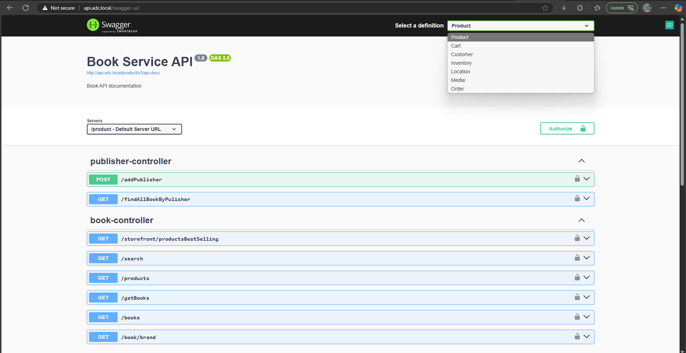

# Book Store Microservices



A comprehensive e-commerce bookstore built with a Microservices Architecture.

---

## Tech Stack
- **Backend:** Java 21, Spring Boot 3.4.2, Spring Cloud Gateway (BFF)
- **Frontend:** Next.js
- **Database:** PostgreSQL 16
- **Identity & Access Management:** Keycloak 26.0.2
- **Reverse Proxy:** Nginx 1.27.2
- **Infrastructure:** Docker & Docker Compose

---

## System Prerequisites

To run this project locally, ensure your machine meets the following requirements:
- **Operating System:** Windows 10/11 (with **WSL2** enabled is highly recommended) or Linux/macOS.
- **Docker:** Docker Desktop installed and running.
- **Java:** JDK 21 installed for building microservices.
- **Node.js:** v18+ for running the Next.js storefront.

---

## Installation & Setup

Follow these steps to set up and run the application on your local machine.

### Step 1: Configure Local Domains (Hosts File)
To route traffic properly through Nginx, you must map the local domains to your `localhost`.

**For Windows Users:**
1. Open Notepad as **Administrator**.
2. Open the file: `C:\Windows\System32\drivers\etc\hosts`
3. Add the following lines to the bottom of the file:
   ```text
   127.0.0.1   storefront.local
   127.0.0.1   api.local
   127.0.0.1   pgadmin.local
   127.0.0.1   identity.local
   ```
4. Save and close.

### Step 2: Environment Variables (Added)
### Step 3: Build Java Executables (.jar)
Before running Docker, you must compile the Spring Boot applications into .jar files so Docker can build the images. Run this command in the root directory (or inside each service folder):
   ```bash
    ./mvnw clean package -DskipTests
   ```
### Step 4: Run Docker Compose
Once the .jar files are built, use Docker Compose (V2) to build the images and start all containers.
   ```bash
    docker compose up -d --build --force-recreate
   ```
### Step 5: Start the Frontend (Next.js)

---

### You might also want to explore:

Once all services are up and running, you can access the following dashboards:

| Service | URL | Credentials (Username / Password) |
| :--- | :--- | :--- |
| **Storefront Web** | `http://storefront.local/` | *N/A* |
| **Swagger UI (APIs)** | `http://api.local/swagger-ui/` | *N/A* |
| **Keycloak (Identity)** | `http://identity.local/` | `admin` / `admin` |
| **pgAdmin (Database)** | `http://pgadmin.local/` | `admin@adc.com` / `admin` |

#### pgAdmin Setup Instructions:
1. Login with `admin@adc.com` / `admin`.
2. Click **Add New Server**.
3. **General Tab:** Name it `PostgreSQL Server`.
4. **Connection Tab:**
    - Host name/address: `postgres` *(the docker container name)*
    - Port: `5432`
    - Username: `admin`
    - Password: `admin`
5. Save the connection.

*(Note: The PostgreSQL database is also exposed to your host machine. You can connect to it using DBeaver or DataGrip via `localhost:5432` with user/pass: `admin`/`admin`).*